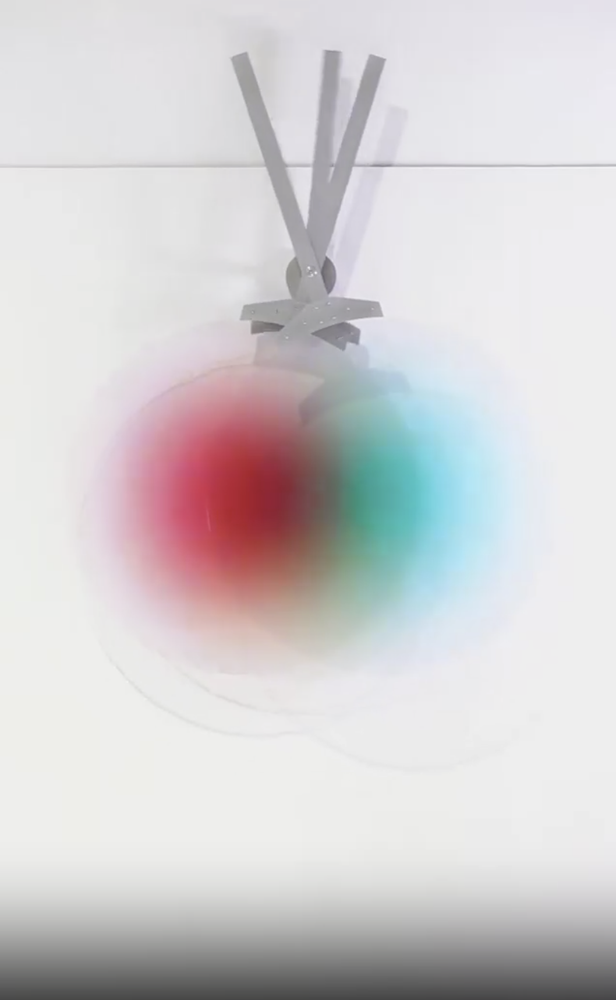

# Quiz 8 - Project Documentation
## Imaging Technique Inspiration

The design mainly involves visitors shaking or moving the installation, causing the three primary color circles to overlap, thereby creating a dynamic visual effect through color blending. I want to incorporate the idea of shaking and overlapping in my creation. The interaction that initiates the work can also follow the same interactive approach. This kind of dynamic interaction can amplify the visual impact exponentially, and it can be easily applied in code design. Various shapes and overlapping elements can be incorporated into this concept.
## Coding Technique Exploration
